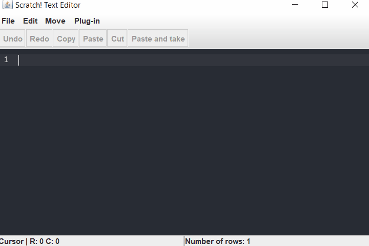

# Scratch Text Editor
Welcome to Scratch! Text Editor. This text editor was made entirely, as you might guess, from scratch!



## About
This text editor was made entirely from scratch. Every single small feature such as text selection, cursor, character insertion or copy & paste was built from the ground up. Only pre-built components used were Java Swing's GUI classes such as button or a toolbar.

## Functional features
* Text insertion
* Text deletion
* Text selection
* Copy, paste and cut
* Undo/redo for each text manipulating action
* Status bar that displays:
  * Cursor location
  * Total number of rows
* File saving and opening
* Dynamic plugin support

## Design features
* Line numbering
* Current line highlighting
* Selected text highlighting
* Dark theme

## Dynamic plugin support
This text editor also supports third party plugins implementations. However, each plugin has to follow the contract by implementing the Plugin interface:

``` java
public interface Plugin
{
    String getName();
    String getDescription();
    void execute(TextEditorModel model, UndoManager undoManager, ClipboardStack clipboardStack);
}
```

Plugin's `execute` method will receive:
* `model` which holds editor's internal state and offers an interface for modifying said state
* `undoManager` which can undo/redo previously performed actions
* `clipboardStack` which acts as a buffer for copy, cut & paste actions

Thank you for reading! :smiley:
